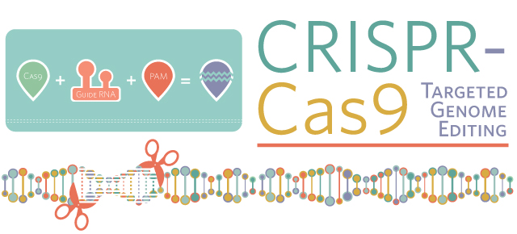

# Awesome-iGEM-Models

The *International Genetically Engineered Machine Competition* (**iGEM**) has built a platform for undergraduates to show and exchange their creative ideas about Synthetic Biology. Project Modelling nowadays becomes a more and more important part in the competition and many iGEM models worth further studying and analyzing.

We now consider to collect representative models concerning CRISPR system and machine learning which are mostly related to our work. Next, we intend to organize iGEM models about key scientific issues on our Github page.

List of outstanding models about CRISPR system and machine learning in the last 3 year on iGEM Team Wikis.

### CRISPR System

+ [2019 SJTU-BioX-Shanghai](https://2019.igem.org/Team:SJTU-BioX-Shanghai/Model)
  **Name:**  Target Recognition Model
  **Type:**  Kinetic Model
  **Functions:**  Find the numbers and locations of lure  sequences and give coresponding intructions to the project 
  **Evaluation:** The approximation works well for single mismatch situation. A computational solution for multi-mismatch situation is provided. 
  
  

+ [2019 Peking](https://2019.igem.org/Team:Peking/Model)

  **Name:**  

  1. Regulatory Model

  2. Stochastic Model of dCas9 Binding and Replication Initiation

  3. Plasmid Copy Number Hacking Model

  4. Gene Expression Noise Control Model

  5. Productivity Model

  6. Quorum Sensing Model

  **Type:**  

  1. ODE
  2. Markov chain
  3. Logistic process
  4. Yule-Furry process
  5. ODE
  6. PDE

  **Functions:**  

  1. Explain the mechanisms of their  system's regulation parts.

  2. Show that their system hacks the  bacteria's replication rate.
  3. Discuss how their system can control  the plasmid copy number.
  4. Illustrate how their system can  control the expression noise in a cell.
  5. Explain why their system is able to  increase the cells' productivity to multiple types of products like GFP and  indigo.
  6. Illustrate how their system works  coupling with a quorum sensing system. 

  **Evaluation:**   Model 5 and 6 were validated by  experiments.  

  

+ [2019 Newcastle](  https://2019.igem.org/Team:Newcastle/Model )

  **Name:**  

  1. CRISPR SHERLOCK Kinetic Model

  2. Glutathione Detection Kinetic Model

  3. Eicosane Detection Kinetic Model

  **Type:** Kinetic Model

  **Functions:**  

  1. Understand how different CPLX1 concentrations impact the time until maximum active GFP was established

  2. Follow glutathione degradation into glycine.

  3. Understand the amount of RFP produced in the presence of varying concentrations of either glutathione or eicosane.

  **Evaluation:** 

  1. The model would give a more true  reflection of the system if crRNA degradation by trans-cleavage was also  included. Rates used were equal to degradation of CPLX1 mRNA degradation and  GFP activation. Inclusion of crRNA degradation did not impact time until  maximum GFP concentration.
  2. The model should be re-parameterised  in the future to include enzyme rates for E. coli become available. 
  3. The model allowed greater  understanding of the system and careful consideration for the other two  systems to ensure both would be functional. 

  

+ [2019 CCU Taiwan](https://2019.igem.org/Team:CCU_Taiwan/Model)

  **Name:**  ASFAST

  **Type:**  Kinetic model

  **Functions:**  Find out the reaction rate of ASFAST under different virus D.A concentration and take this as a reference to set its detection limit。

  **Evaluation:**  More researches have to be done on the dissociation rate of trans activity to determine the exact rate of its reverse reaction.

  

+ [2018  TJU China](http://2018.igem.org/Team:TJU_China/Model)

  **Name:**    

  1. Dynamic Model of Heavy Metal Detection  Biosensor  

  2. Free Energy Model of Off-target  Problem  

  **Type:**  

  1. ODE  

  2. Probability theory and dynamic  deduction

  **Functions:** 

  1. Characterize the pathways quantitatively and predict their performance.

  2. Investigate the off-target problem in gene editing by the CRISPR-Cas system.

  **Evaluation:**    

  1. The concentration of smURFP is relatively sensitive to parameters such as ktx3,ktl3,ktx4,kb4,kb6,kd2,kd5, kd6,kd7,kd8,kd11, etc. However, due to the lack of previous modeling studies  on dCas9-RNAP, some kinetic parameters may not be very accurate.  

  2. After testing, they find its rate can  reach approximately 2e8 base/h(under parallel computing in 4 cores).  Besides the default para:meters, they hope their model can hit more true data.  

  

+ [2018 ZJUT-China](http://2018.igem.org/Team:ZJUT-China/Model)

  **Name:** System Modeling

  **Type:** ODE

  **Fucntions:**  Predict the time point when the all antibiotic resistance genes(ARGs) are cut off and the cell auto-lysis is going to begin.

  **Evaluation:**  Just a quite weak pulsed light signal is enough to start the operation of their system. The system is safe because the accidental leakage of bacteria will cut off all the ARGs and autolysis for the natural light.

  

+ [2017 MIT](http://2017.igem.org/Team:MIT/Model)

  **Name:**    SpliceMIT – Splice Modelling Intronic  Technology  

  **Type:**  Non-parametric statistical method

  **Fucntions:**  Generate antisense oligonucleotides (ASO) for a given DNA/RNA sequence, and then analyze and output the most effective ASOs.

  **Evaluation:** The probabilities of secondary structure of gRNA sequence and pre-gRNA sequences are compared. The correlation efficient is 0.91, with an extremely low p-value. 

+ [2017 British Columbia](http://2017.igem.org/Team:British_Columbia/Model)

  **Name:**   CRISPR Activity Model  

  **Type:**  Biophysical model

  **Fucntions:**  Provide the program with the appropriate genome and target gene sequence, and return a list of potential guide sequences ranked from best to worst.

  **Evaluation:**  Using this model, they have designed sgRNAs to target essential virulence regions in Agrobacterium. The guides obtained from running the model were shown to be effective *in vitro*.

+ [2017 Toronto](2017.igem.org/Team:Toronto/Drylab)

  **Name:**   LacILov System Model

  **Type:**   ODE  

  **Functions:**  Capture the dynamics of construct developed in the Wet Lab to further characterize its behaviour.

  **Evaluation:**  Adjusted R-squared=0,8238  p-value=9.741e-16.  

